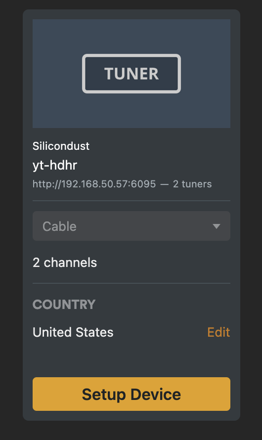
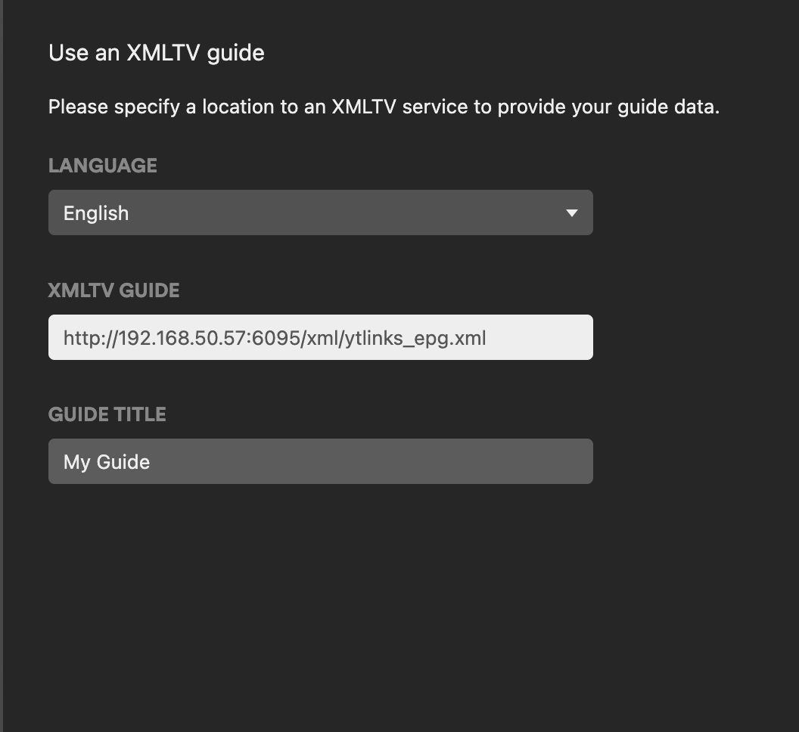

# yt-hdhr

Note: shoutout to @purplescorpion1 who wrote the [original project I forked for this](https://github.com/purplescorpion1/youtube-to-m3u). Also, Copilot helped out with the Python code as I'm a nodejs guy.

## How It Works

This is a containerized Flask server that proxies yt live streams and emulates an HDHR tuner, along with outputting a separate M3U playlist and EPG file. It uses [Streamlink](https://streamlink.github.io/) and [yt-dlp](https://github.com/yt-dlp/yt-dlp) to resolve yt live stream URLs. Streams are defined in an XML file.

### HDHR Emulation

The server exposes the same HTTP endpoints as a real HDHR network tuner (`/discover.json`, `/lineup.json`, `/lineup_status.json`, `/device.xml`) and runs an SSDP service so that clients can discover the virtual tuner on your local network.

## Prerequisites

- [Docker](https://docs.docker.com/get-docker/)
- [Docker Compose](https://docs.docker.com/compose/install/) (included with Docker Desktop)

## Quick Start

1. Update the volume in `docker-compose.yml` to mount your local `data/` directory:

   ```yaml
   volumes:
     - ./data:/data
   ```

   Place your `ytlinks.xml` file in the `data/` directory to define your channels. See [Channel Configuration via XML](#channel-configuration-via-xml).

2. Set the `HOST_IP` environment variable in `docker-compose.yml` to the IP address of the machine running the container. You shouldn't have to alter any other default variables but see [Environment Variables](#environment-variables) for more options.

   ```yaml
   environment:
     - HOST_IP=192.168.1.123
   ```

3. Start the container:

   ```bash
   docker compose up -d
   ```

4. The server will be available at `http://<HOST_IP>:6095`. HDHR clients should be able to discover it automatically.
   - Access your m3u playlist at:

   ```
   http://<HOST_IP>:6095/m3u/ytlive.m3u
   ```

   - Access your EPG at:

   ```
   http://<HOST_IP>:6095/epg/ytlinks_epg.xml
   ```

5. Add your HDHR tuner to Plex under Manage -> Live TV & DVR -> Add Device. <br>

   

   

## Build and Run Manually

```bash
docker build -t yt-hdhr .
docker run --network host -v ./data:/data -e HOST_IP=192.168.1.123 -e SERVER_PORT=6095 yt-hdhr
```

## Docker Compose Configuration

The `docker-compose.yml` uses `network_mode: host` for SSDP auto-discovery and mounts the local `./data` directory into the container at `/data`. At startup, if `ytlinks.xml` is present in the data directory, the server automatically generates `ytlive.m3u` and `ytlinks_epg.xml` from it.

## Environment Variables

| Variable             | Description                                  | Default         |
| -------------------- | -------------------------------------------- | --------------- |
| `HOST_IP`            | IP address used in generated m3u stream URLs | `192.168.1.123` |
| `SERVER_PORT`        | Port the Flask server listens on             | `6095`          |
| `M3U_DIR`            | Directory for m3u/xml files inside container | `/data`         |
| `HDHR_DEVICE_ID`     | Custom HDHR device ID (8-char hex)           | auto-generated  |
| `HDHR_FRIENDLY_NAME` | Device name shown in Plex during discovery   | `yt-hdhr`       |
| `HDHR_TUNER_COUNT`   | Number of simultaneous tuners to advertise   | `2`             |
| `HDHR_MANUFACTURER`  | Manufacturer string in device info           | `Silicondust`   |
| `HDHR_MODEL`         | Model number in device info                  | `HDTC-2US`      |

## Channel Configuration via XML

Define your channels in `ytlinks.xml` and place it in the `data/` directory. The server will automatically generate `ytlive.m3u` and an XMLTV EPG file (`ytlinks_epg.xml`) at startup. Channel numbers are automatically assigned based on order, or you can set them explicitly with `<channel-number>`.

```xml
<channels>
    <channel>
        <channel-name>Duluth Canal Cam</channel-name>
        <tvg-id>DuluthCanalCam.us</tvg-id>
        <tvg-name>Duluth Canal Cam</tvg-name>
        <tvg-logo>https://images.clubexpress.com/605134/graphics/Duluth_Harbor_Cam_1440771302.png</tvg-logo>
        <group-title>Live</group-title>
        <yt-url>https://www.youtube.com/watch?v=HPS48TMmNag</yt-url>
    </channel>
</channels>
```

### XML Field Reference

| Field            | Description                                                    | Required |
| ---------------- | -------------------------------------------------------------- | -------- |
| `channel-name`   | Display name of the channel                                    | Yes      |
| `tvg-id`         | EPG tag matching your EPG source's tvg-id                      | Yes      |
| `tvg-name`       | Channel name used in the m3u tvg-name attribute                | No       |
| `tvg-logo`       | Direct URL to the channel logo image                           | No       |
| `group-title`    | Group the channel appears in (e.g., News, Sports)              | No       |
| `channel-number` | Channel number (auto-assigned if omitted)                      | No       |
| `yt-url`         | yt live stream URL — `@channelname/live` or `/watch?v=` format | Yes      |

You can also regenerate the m3u and EPG on-demand (e.g., after editing the XML) by visiting:

```
http://<HOST_IP>:6095/generate
http://<HOST_IP>:6095/epg
```

## Endpoints

### Stream & Playlist Endpoints

| Endpoint                   | Description                                             |
| -------------------------- | ------------------------------------------------------- |
| `/stream?url=<yt-url>`     | Proxies a yt live stream via Streamlink                 |
| `/m3u/<filename>`          | Serves `.m3u` files from the data directory             |
| `/xml/<filename>`          | Serves `.xml` files from the data directory             |
| `/epg/<filename>`          | Serves EPG `.xml` files from the data directory         |
| `/generate`                | Generates `ytlive.m3u` from `ytlinks.xml` and serves it |
| `/generate?xml=<filename>` | Generates an m3u from a custom XML file                 |
| `/epg`                     | Generates EPG from `ytlinks.xml` and serves it          |
| `/epg?xml=<filename>`      | Generates EPG from a custom XML file                    |

### HDHR Emulation Endpoints

| Endpoint              | Description                                              |
| --------------------- | -------------------------------------------------------- |
| `/discover.json`      | Device discovery info (DeviceID, TunerCount, etc.)       |
| `/lineup.json`        | Channel lineup with stream URLs (read by Plex)           |
| `/lineup_status.json` | Lineup scan status                                       |
| `/device.xml`         | UPnP device descriptor XML (used by SSDP auto-discovery) |
| `/lineup.post`        | Handles lineup scan trigger from Plex                    |
